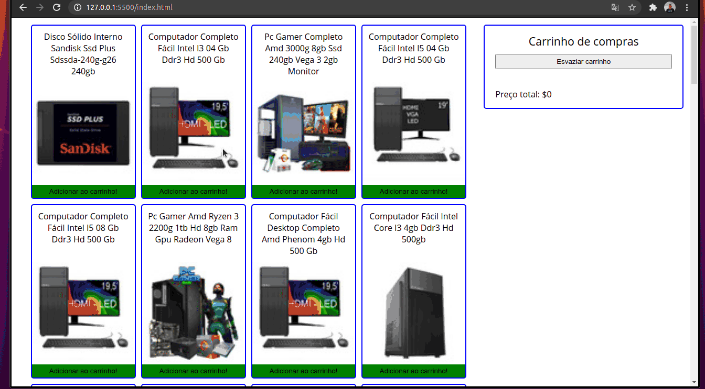

## Projeto de Carrinho de Compras!

### Habilidades

- Fazer requisições a uma API *(Application Programming Interface)* do Mercado Livre;
- Utilizar os seus conhecimentos sobre JavaScript, CSS e HTML;
- Trabalhar com funções assíncronas;

---

Nesse projeto eu fiz um **carrinho de compras** totalmente dinâmico! E o melhor: consumindo dados diretamente de uma **API!**. Da sigla em inglês _Application Programming Interface_, uma API é um ponto de contato na internet com determinado serviço. Através de **requisições HTTP** a essa API é possível interagir com ela da forma como quem a criou planejou. Aqui utilizei a API do Mercado Livre para buscar os produtos à venda.

---
### Protótipo do projeto

---

### Requisitos do projeto

#### 1 - Crie uma listagem de produtos

#### 2 - Adicione o produto ao carrinho de compras

#### 3 - Remova o item do carrinho de compras ao clicar nele

#### 4 - Carregue o carrinho de compras através do **LocalStorage** ao iniciar a página

#### 5 - Some o valor total dos itens do carrinho de compras

#### 6 - Crie um botão para limpar carrinho de compras

#### 7 - Adicione um texto de "loading" durante uma requisição à API
